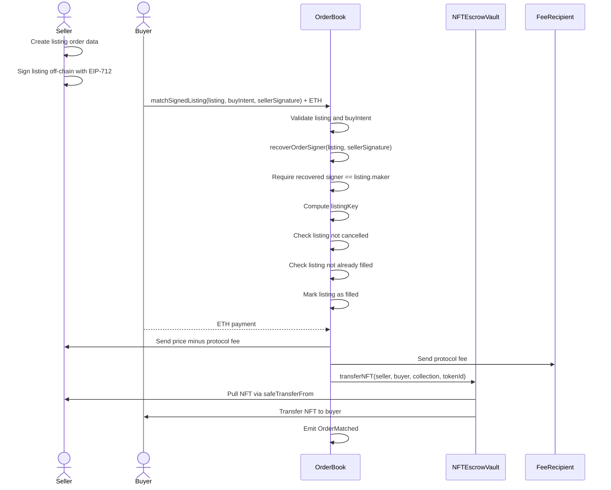

# NFT Order Book

## Overview
This reimplements `EasySwapContract` for practice purpose.

In **escrow-first** design, an order is only real after the maker has already locked the required asset:
- Seller moves NFT into the escrow contract before creating a listing
- Buyer moves ETH into the escrow contract before making an offer

This design gives stronger guarantees and simpler settlement, but costs more gas, locks assets, and puts more risk in the high-value escrow contract.

## Rebuild Steps
- Init a Hardhat v2 project
```bash
mkdir NFTOrderBook
cd NFTOrderBook
npm init -y
npm install --save-dev hardhat@^2.22.0
npx hardhat
```
When the prompt appears, choose something like:
```text
Create a JavaScript project
```
That will generate a basic structure like:
```text
NFTOrderBook/
  contracts/
  scripts/
  test/
  hardhat.config.js
  package.json
```
- Install dependencies
```bash
npm install --save-dev @openzeppelin/contracts
```

- Create contracts
```
contracts
   |_______interfaces
   |           |_____INFTEscrwVault.sol
   |           |_____IOrderBook.sol
   |           |_____IOrderStorage.sol
   |_______libraries
   |           |_____OrderHashing.sol
   |           |_____OrderTypes.sol
   |           |_____OrderValidator.sol
   |_______NFTEscrowVault.sol
   |_______OrderBook.sol
   |_______OrderState.sol
   |_______OrderStorage.sol
   |_______ProtocolFeeManager.sol
```
- Deploy to Hardhat’s default in-memory local network.
```bash
cd NFTOrderBook
npx hardhat run scripts/deploy.js

Deploying with account: 0xf39Fd6e51aad88F6F4ce6aB8827279cffFb92266
NFTEscrowVault deployed to: 0x5FbDB2315678afecb367f032d93F642f64180aa3
OrderBook deployed to: 0xe7f1725E7734CE288F8367e1Bb143E90bb3F0512
Vault orderBook set to: 0xe7f1725E7734CE288F8367e1Bb143E90bb3F0512
```
- Deploy to a persistent local network
```bash
npx hardhat node

# in another terminal
npx hardhat run script/deploy.js --network localhost
```

- Create test script
```bash
test
   |_______OrderBook.js
```

- Run test
```bash
cd NFTOrderBook
npm test
```

---
## Signed-order Settlement Model

Current escrow-first flow:
```text
maker creates order on-chain -> asset moves into vault -> taker matches later
```

Signed-order flow:
```text
maker signs order off-chain -> taker submits order + signature on-chain -> contract verifies signature -> settlement happens atomically
```
So the maker does not call `createOrder` first. They sign a typed message. The taker pays gas to settle it.

Step1: Adds EIP-712 support
Step2: Signature verification, seller signs this exact Order object off-chain and contract verifies the signature.
Step3: Settlement where the buyer submits the seller’s signed listing, sends ETH, and the contract verifies the signature before transferring the NFT.
