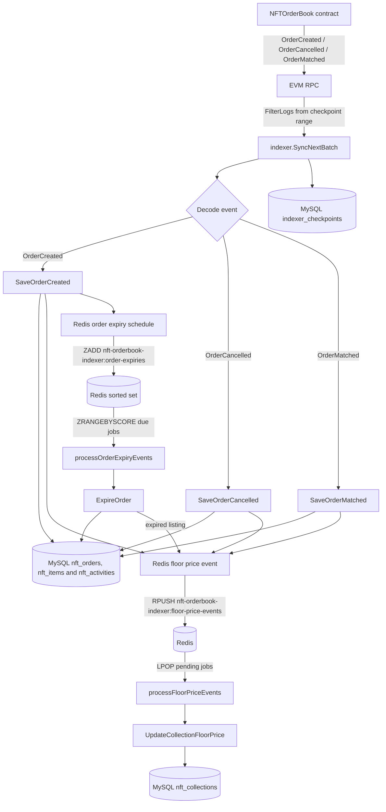
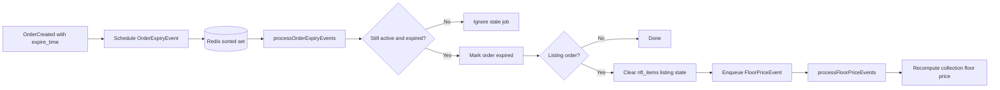
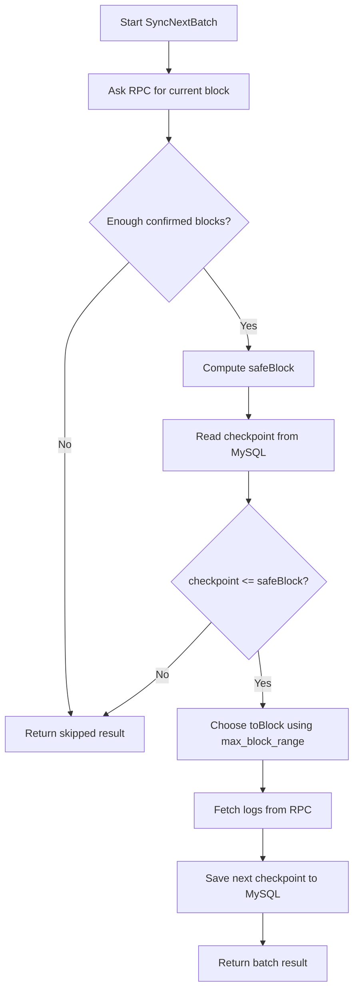

# NFTOrderBookIndexer

NFTOrderBookIndexer indexes `NFTOrderBook` events from an EVM chain into marketplace database tables and Redis-backed background queues.

The service polls blockchain logs from the configured order book contract, decodes order events, writes canonical order/item/activity/collection state to MySQL, and pushes follow-up work into Redis for order expiry and floor price maintenance.

## What It Syncs

The main indexer listens for these on-chain events:

- `OrderCreated`: creates listing, collection bid, or item bid records.
- `OrderMatched`: marks matched orders filled, records a sale, and updates item ownership/listing state.
- `OrderCancelled`: marks orders cancelled and clears listing state when applicable.

The service also maintains current collection floor price and expires stale orders after their `expire_time`.

## Architecture

```text
main.go
  -> cmd/root.go
     -> loads config through Cobra/Viper
  -> cmd/daemon.go
     -> loads config and calls app.RunCheckpointBatch
  -> internal/app/service.go
     -> wires MySQL, Redis, chain client, indexer, and workers
  -> internal/indexer/service.go
     -> polls blockchain logs and writes indexed state
  -> internal/store/*.go
     -> wraps MySQL and Redis persistence details
```

Runtime dependencies:

- MySQL: durable source of truth for indexed marketplace state.
- Redis: lightweight queue storage for derived background work.
- EVM RPC endpoint: used to fetch block numbers and contract logs.

## Data Flow



The important rule is: MySQL receives the canonical event write first. Redis only receives lightweight follow-up messages, such as "this collection's floor price should be recalculated" or "this order should be checked when its expiry time arrives."

Current floor price is recomputed from active listing rows:

```sql
SELECT MIN(price), COUNT(*)
FROM nft_orders
WHERE chain_id = ?
  AND collection_address = ?
  AND order_type = 'listing'
  AND order_status = 'active'
  AND quantity_remaining > 0
  AND (expire_time = 0 OR expire_time > UNIX_TIMESTAMP());
```

The result is stored in `nft_collections.floor_price` and `nft_collections.active_listing_count`.

## Expiry/Floor-price Worker Flow



## Database Tables

The migration files are in `db/migrations/`. The learning indexer currently writes these tables:

- `indexer_checkpoints`: last indexed block per chain/indexer.
- `nft_orders`: current order state.
- `nft_items`: item owner and current listing state.
- `nft_activities`: immutable activity/feed rows from order events.
- `nft_collections`: collection-level derived state, including current floor price and active listing count.

The checkpoint row is created automatically by `SaveLastIndexedBlock` after a successful batch. If no checkpoint exists yet, the indexer starts from `chain.start_block` in your config.

Example checkpoint query:

```sql
SELECT chain_id, indexer_name, last_indexed_block
FROM indexer_checkpoints;
```

## Redis Queues

Redis is not the durable source of truth. In these milestones, it is used for derived background work.

Primary keys:

- `nft-orderbook-indexer:floor-price-events`: JSON queue of collections whose floor price should be recalculated.
- `nft-orderbook-indexer:order-expiries`: sorted set of orders keyed by `expire_time`.

Floor-price queue items have this shape:

```json
{
  "chain_id": 11155111,
  "collection_address": "0x...",
  "reason": "order_created"
}
```

Order-expiry sorted-set items have this shape:

```json
{
  "chain_id": 11155111,
  "order_id": "0x...",
  "expire_time": 1730000000
}
```

The daemon writes canonical order/item/activity rows to MySQL first, schedules expiring orders in Redis, drains due expiry jobs, then drains pending floor-price jobs and updates `nft_collections`.

## Prerequisites

- Go 1.25+
- Docker and Docker Compose, for local MySQL/Redis
- MySQL 8.0
- Redis 6.2+
- An EVM RPC URL for the configured chain

Expected local layout:

```text
nft-marketplace/
  NFTOrderBook/
  NFTOrderBookIndexer/
```

## Start MySQL and Redis

For amd64:

```shell
docker-compose up -d
```

The default compose files create:

- MySQL database: `easyswap`
- MySQL user: `easyuser`
- MySQL password: `easypasswd`
- Redis: `127.0.0.1:6379`

## Initialize Database

For an existing local database, apply migrations in order:

```shell
mysql -h 127.0.0.1 -P 3306 -u easyuser -peasypasswd easyswap < db/migrations/01_create.sql
mysql -h 127.0.0.1 -P 3306 -u easyuser -peasypasswd easyswap < db/migrations/02_remove_order_taker.sql
mysql -h 127.0.0.1 -P 3306 -u easyuser -peasypasswd easyswap < db/migrations/03_add_activity_counter_order_id.sql
mysql -h 127.0.0.1 -P 3306 -u easyuser -peasypasswd easyswap < db/migrations/04_create_collections.sql
```

The checkpoint row is created by the daemon after the first successful batch. The initial batch starts from `chain.start_block` in your config.

## Configure

Create the runtime config file expected by the CLI:

```shell
cp config/config.toml.example config/config.toml
```

Edit `config/config.toml` and verify:

- `db.*` points at your local MySQL.
- `redis.*` points at your local Redis.
- `chain.rpc_url` includes a working API key if your RPC provider requires one.
- `chain.start_block` is near the deployment block of your `NFTOrderBook` contract.
- `contract.orderbook_address` is the deployed `NFTOrderBook` address.

## Run

Run directly:

```shell
go run . daemon -c ./config/config.toml
```

Run tests:

```shell
go test ./...
```

Build only:

```shell
go build -o ./bin/nft-orderbook-indexer .
./bin/nft-orderbook-indexer daemon -c ./config/config.toml
```

## Rebuild Path from `EasySwapSync`

### Milestone 1: CLI + config loads
[Git commit](https://github.com/LiamZhuangDev/nft-marketplace/commit/bf65436a7f52ebe86fc2156a8f5a26f6f247d618)

Install cobra and viper dependencies:
```shell
go get github.com/spf13/cobra
go get github.com/spf13/viper
```

The execution order is roughly:
```text
program starts
  -> Go initializes imported packages
  -> package-level variables are created
       cfgFile
       rootCmd
       daemonCmd
  -> init() functions run
       root.go init(): adds --config flag
       daemon.go init(): adds daemon subcommand
  -> main() runs
       cmd.Execute()
  -> Cobra parses args and runs command
```

The command to run is:
```shell
go run . daemon -c ./config/config.toml.example
```
The execution path is:
```text
main.go
  -> cmd.Execute()
     -> rootCmd.Execute()
        -> sees subcommand "daemon"
           -> runs daemonCmd.RunE(...)
              -> loads config
              -> prints config
```
### Milestone 2: DB + Redis connect
[Git commit](https://github.com/LiamZhuangDev/nft-marketplace/commit/389fdc8b91133fd5a037e2366764be847bb86e29)

Install mysql and redis dependencies:
```shell
go get github.com/go-sql-driver/mysql
go get github.com/redis/go-redis/v9
```
Start MySQL and Redis:
```shell
$ cd NFTOrderBookIndexer
$ docker compose up -d
$ docker ps
CONTAINER ID   IMAGE       COMMAND                  CREATED          STATUS          PORTS                                                    NAMES
ba3433d0d15b   redis:6.2   "docker-entrypoint.s…"   10 seconds ago   Up 10 seconds   0.0.0.0:6379->6379/tcp, [::]:6379->6379/tcp              redis
4ff1ad858f6b   mysql:8.0   "docker-entrypoint.s…"   10 seconds ago   Up 10 seconds   0.0.0.0:3306->3306/tcp, [::]:3306->3306/tcp, 33060/tcp   mysql
```

Clean dev reset if needed:
```shell
$ docker compose down -v # deletes the local MySQL data volume.
$ docker compose up -d
```

If something on your host machine is already using port `3306`, most likely MySQL, stop it before run docker:
```shell
sudo lsof -i :3306
COMMAND  PID  USER   FD   TYPE DEVICE SIZE/OFF NODE NAME
mysqld  1471 mysql   23u  IPv4   5743      0t0  TCP localhost:mysql (LISTEN)

sudo systemctl stop mysql
```

Connect MySQL and Redis:
```shell
$ go run . daemon -c ./config/config.toml
config loaded successfully
mysql connected: 127.0.0.1:3306/easyswap
redis connected: 127.0.0.1:6379 db=0
```

### Milestone 3: current block prints
Install `ethclient` go wrapper
```shell
go get github.com/ethereum/go-ethereum
```

Connect to ETH RPC and fetches the current block
```go
eth, err := ethclient.DialContext(ctx, cfg.RPCURL)
if err != nil {
   return nil, fmt.Errorf("dial rpc %q: %w", cfg.RPCURL, err)
}
eth.BlockNumber(ctx)
```

### Milestone 4: checkpoint loop fetches logs
[Git Commit](https://github.com/LiamZhuangDev/nft-marketplace/commit/88aadd79f36e0a0f4532a1bf0d07f8354d140e63)

The key indexing idea: `The indexer should read the last indexed block (checkpoint) from DB and index only up to safe block.`


```go
logs, err := s.chain.FilterLogs(ctx, fromBlock, toBlock, s.cfg.Contract.OrderbookAddress)
```

Apply DB migration to add `index_checkpoints` table if haven't done:
```shell
cd NFTOrderBookIndexer
mysql -h 127.0.0.1 -P 3306 -u easyuser -peasypasswd easyswap < db/migrations/01_create.sql
```

Then run:
```shell
go run . daemon -c ./config/config.toml
```

Expected output shape:
```
config loaded successfully
mysql connected: 127.0.0.1:3306/easyswap
redis connected: 127.0.0.1:6379 db=0
chain connected: sepolia chain_id=11155111 current_block=11010682
fetched logs: from_block=0 to_block=99 count=0 order_created_count=0 order_cancelled_count=0 order_matched_count=0 next_checkpoint=100 safe_block=11010674
```

### Milestone 5: OrderCreated creates DB rows
[Git Commit](https://github.com/LiamZhuangDev/nft-marketplace/commit/e0494586b17003e43a373d0e0fa245b46a726922)
What changed:
```text
1. Added tables in 01_create.sql:
   - nft_orders
   - nft_items
   - nft_activities
2. Added DB models in internal/model/orderbook.go
3. Added DB write logic in internal/store/orderbook.go
4. Added OrderCreated ABI/topic decode logic in internal/indexer/events.go
5. Updated SyncNextBatch so:
   - fetch logs
   - skips non-OrderCreated logs
   - decodes OrderCreated
   - inserts order/item/activity rows
   - advances checkpoint after successful processing
```

Apply migration before indexing to create required tables:
```shell
mysql -h 127.0.0.1 -P 3306 -u easyuser -peasypasswd easyswap < db/migrations/01_create.sql
```

### Milestone 6: OrderCancelled updates DB rows
[Git Commit](https://github.com/LiamZhuangDev/nft-marketplace/commit/2e434e07b01fddf561e8a1d2ad65742238afc3d2)
What changed:
```text
1. Added OrderCancelled ABI/topic decode logic in internal/indexer/events.go
2. Added OrderCancelled model in internal/model/orderbook.go
3. Added SaveOrderCancelled in internal/store/orderbook.go
4. Updated SyncNextBatch so:
   - detects OrderCancelled logs
   - decodes order key and maker from indexed topics
   - loads the existing order row
   - marks the order cancelled
   - clears item listing state for listing orders
   - inserts an order_cancelled activity row
   - advances checkpoint after successful processing
```

### Milestone 7: OrderMatched updates DB rows
[Git Commit](https://github.com/LiamZhuangDev/nft-marketplace/commit/83eac76265f50a4650e7f5f9c832da98815963ee)
What changed:
```text
1. Added OrderMatched ABI/topic decode logic in internal/indexer/events.go
2. Added OrderMatched and MatchedOrderSnapshot models in internal/model/orderbook.go
3. Added SaveOrderMatched in internal/store/orderbook.go
4. Updated SyncNextBatch so:
   - detects OrderMatched logs
   - decodes listing order, offer order, and fill price
   - marks the listing order filled
   - reduces the offer order quantity if it exists locally
   - moves item ownership to the buyer
   - clears item listing state
   - inserts an order_matched activity row
   - advances checkpoint after successful processing
```

### Milestone 8: Redis event consumer updates floor price
[Git Commit](https://github.com/LiamZhuangDev/nft-marketplace/commit/dfa4b8be0a63d249461e838ece1d94d225d1d782)
What changed:
```text
1. Added Redis floor-price queue: floorprice_queue.go
2. Indexer now enqueues a floor-price refresh after OrderCreated, OrderCancelled, and OrderMatched.
3. App daemon now consumes pending Redis floor-price events after each batch.
4. DB store recomputes floor price from active listings and writes nft_collections table
5. Added nft_collections schema to fresh migration and exiting-db migration
```
### Milestone 9: order expiry worker
[Git Commit](https://github.com/LiamZhuangDev/nft-marketplace/commit/fa2219a8607923d7ec25cd808e4e1c29c5162d7b)
What changed:
```text
1. Added Redis order-expiry sorted set: order_expiry_queue.go
2. Indexer schedules an expiry job after OrderCreated when expire_time is nonzero.
3. App daemon consumes due expiry jobs after each checkpoint batch.
4. DB store expires only orders that are still active and whose expire_time has passed.
5. Expired listing orders clear item listing state and enqueue a floor-price refresh.
```
### Milestone 10: README + diagrams + tests
What changed:
```text
1. Updated README architecture, setup, run, troubleshooting, Redis, and data-flow notes.
2. Added Mermaid diagrams for the chain-to-DB/Redis path and background workers.
3. Added dependency-free tests in internal/test for worker loops and fake-chain order events.
4. Refactored app worker helpers to accept small interfaces, so they can be tested with fakes.
5. Verified the project with go test ./...
```

---

## Operational Notes

- The indexer polls block ranges instead of subscribing to a websocket stream.
- It waits for a small chain-specific confirmation buffer before indexing blocks.
- Sync progress is stored in `indexer_checkpoints.last_indexed_block`.
- MySQL writes are the canonical indexed state; Redis queues only coordinate derived background work.
- Use a realistic `last_indexed_block`; starting from block `0` can be very slow and may exceed RPC provider limits.

## Troubleshooting

Missing config:

```text
open ./config/config.toml: no such file or directory
```

Create `config/config.toml` from the template.

RPC says unauthorized:

```text
Unauthorized: You must authenticate your request with an API key
```

Use an RPC URL with a valid API key, or switch to a public endpoint that supports the target chain.

No logs are indexed:

- Check `contract.orderbook_address`.
- Check `chain.id` and `chain.name`.
- Check the RPC URL and API key.
- Check that `chain.start_block` is before the contract events you expect.
- Check `indexer_checkpoints.last_indexed_block` if you already ran the daemon.

Redis queue not moving:

- Confirm Redis is running.
- Check the configured `redis.host`.
- Run `go run . daemon -c ./config/config.toml`; this one command processes checkpoint, expiry, and floor-price work for the learning build.
