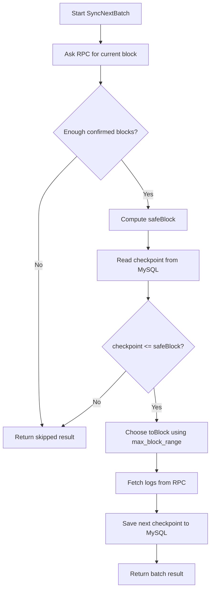

# NFTOrderBookIndexer

NFTOrderBookIndexer indexes `NFTOrderBook` events from an EVM chain into marketplace database tables and Redis-backed background queues.

The service polls blockchain logs from the configured order book contract, decodes order events, writes canonical order/item/activity/collection state to MySQL, and pushes follow-up work into Redis for order expiry, floor price, and listed-count maintenance.

## What It Syncs

The main indexer listens for these on-chain events:

- `OrderCreated`: creates listing, collection bid, or item bid records.
- `OrderMatched`: marks matched orders filled, records a sale, and updates item ownership/listing state.
- `OrderCancelled`: marks orders cancelled and clears listing state when applicable.
- `Approval`: records ERC721 approval activity and checks whether the vault is approved.

The service also maintains collection floor price history and delegates order expiry/list-count work to `EasySwapBase/ordermanager`.

## Architecture

```text
main.go
  -> cmd/root.go
     -> loads config through Cobra/Viper
  -> cmd/daemon.go
     -> initializes config, logger, DB, Redis, chain client
  -> service/service.go
     -> wires MySQL, Redis, collection filter, order manager, orderbook indexer
  -> service/orderbookindexer/service.go
     -> polls blockchain logs and writes indexed state
```

Runtime dependencies:

- MySQL: durable source of truth for indexed marketplace state.
- Redis: fast queues/cache for background order manager work.
- EVM RPC endpoint: used to fetch block numbers, logs, block timestamps, and contract metadata.
- `EasySwapBase`: shared chain, DB model, Redis, logger, and order manager code.

## Data Flow

```text
                 EasySwap DEX Contract
          OrderCreated / OrderMatched / OrderCancelled
                           |
                           | RPC FilterLogs()
                           v
        EasySwapSync orderbookindexer.SyncOrderBookEventLoop
        service/orderbookindexer/service.go
                           |
          +----------------+----------------+
          |                |                |
          v                v                v
  OrderCreated    OrderMatched    OrderCancelled
   create order    match order      cancel order
          |                |                |
          |                |                |
          v                v                v
      MySQL DB         MySQL DB         MySQL DB
   ob_order_*       ob_order_*       ob_order_*
   ob_item_*        ob_item_*        ob_activity_*
   ob_activity_*    ob_activity_*
   ob_collection_*  owner/list state
          |                |                |
          |                |                |
          v                v                v
       Redis            Redis            Redis
 cache:es:orders:*  cache:es:trade:* cache:es:trade:*
 new listing queue  sale event queue cancel event queue
          |                |                |
          +----------------+----------------+
                           v
                  EasySwapBase OrderManager
                           |
       +-------------------+-------------------+
       v                   v                   v
 ListenNewListingLoop  floorPriceProcess  orderExpiryProcess
 new listing queue     trade event queue  time-wheel expiry
       |                   |                   |
       v                   v                   v
   schedules expiry    updates floor      marks expired
   pushes listing      price in DB        pushes expired event
   floor event         updates list cnt
```

## Database Tables

The migration file is in `db/migrations/01_create.sql`. It creates chain-suffixed tables such as:

- `ob_order_<chain>`: indexed order records.
- `ob_activity_<chain>`: listing, bid, sale, cancel, and approval activity.
- `ob_item_<chain>`: item ownership and listing state.
- `ob_item_external_<chain>`: item metadata/image placeholders.
- `ob_collection_<chain>`: collection records and current floor price.
- `ob_collection_floor_price_<chain>`: floor price history.
- `ob_indexed_status`: sync checkpoints.

Important: `SyncOrderBookEventLoop` expects an `ob_indexed_status` row for the target chain and `index_type = 6`. If it is missing, the orderbook event loop exits.

Example for Sepolia:

```sql
INSERT INTO ob_indexed_status
  (chain_id, last_indexed_block, last_indexed_time, index_type, create_time, update_time)
VALUES
  (11155111, 0, UNIX_TIMESTAMP(), 6, UNIX_TIMESTAMP(), UNIX_TIMESTAMP());
```

Set `last_indexed_block` to the block where you want indexing to begin.

## Redis Queues

Redis is not the durable source of truth. It is used for fast background coordination by the order manager.

Primary keys:

- `cache:es:orders:<chain>`: new listing/order queue.
- `cache:es:trade:events:<chain>`: listing, sale, cancel, expired, transfer, and floor-price update events.
- `cache:es:<chain>:collection:listed:<collection>`: cached listed-count values.

The indexer writes canonical state to MySQL first, then pushes events into Redis so `EasySwapBase/ordermanager` can process derived state.

## Prerequisites

- Go 1.21+
- Docker and Docker Compose, for local MySQL/Redis
- MySQL 8.0
- Redis 6.2+
- An EVM RPC URL for the configured chain
- A sibling `EasySwapBase` checkout, because `go.mod` uses:

```text
replace github.com/ProjectsTask/EasySwapBase => ../EasySwapBase
```

Expected local layout:

```text
nft-marketplace/
  EasySwapSync/
  EasySwapBase/
```

## Start MySQL and Redis

For amd64:

```shell
docker-compose up -d
```

For arm64:

```shell
docker-compose -f docker-compose-arm64.yml up -d
```

The default compose files create:

- MySQL database: `easyswap`
- MySQL user: `easyuser`
- MySQL password: `easypasswd`
- Redis: `127.0.0.1:6379`

## Initialize Database

Apply the migrations in order:

```shell
mysql -h 127.0.0.1 -P 3306 -u easyuser -peasypasswd easyswap < db/migrations/01_create.sql
mysql -h 127.0.0.1 -P 3306 -u easyuser -peasypasswd easyswap < db/migrations/02_alter_collection_add_banner.sql
```

Then insert or update the `ob_indexed_status` checkpoint for your chain and starting block.

## Configure

Create the runtime config file expected by the CLI:

```shell
cp "config/config_import.toml copy.template" config/config_import.toml
```

Edit `config/config_import.toml` and verify these sections:

```toml
[project_cfg]
name = "OrderBookDex"

[db]
database = "easyswap"
host = "127.0.0.1"
port = 3306
user = "easyuser"
password = "easypasswd"

[kv]
[[kv.redis]]
host = "127.0.0.1:6379"
type = "node"
pass = ""

[ankr_cfg]
https_url = "https://rpc.ankr.com/eth_sepolia"
api_key = ""

[chain_cfg]
name = "sepolia"
id = 11155111

[contract_cfg]
eth_address = "0x0000000000000000000000000000000000000000"
weth_address = "..."
dex_address = "..."
vault_address = "..."
```

The service reads config from `./config/config_import.toml` by default. You can pass another file with `-c`.

## Run

Run directly:

```shell
go run main.go daemon -c "./config/config_import.toml"
```

Or use the Makefile:

```shell
make run
```

Build only:

```shell
make build
./build/sync_service daemon -c "./config/config_import.toml"
```

Run in the background:

```shell
mkdir -p logs
./run.sh
```

If `monitor.pprof_enable = true`, pprof is exposed on `0.0.0.0:<monitor.pprof_port>`.

## Rebuild Path from `EasySwapSync`

### Milestone 1: CLI + config loads
[Git commit](https://github.com/LiamZhuangDev/nft-marketplace/commit/bf65436a7f52ebe86fc2156a8f5a26f6f247d618)

Install cobra and viper dependencies:
```shell
go get github.com/spf13/cobra
go get github.com/spf13/viper
```

The execution order is roughly:
```text
program starts
  -> Go initializes imported packages
  -> package-level variables are created
       cfgFile
       rootCmd
       daemonCmd
  -> init() functions run
       root.go init(): adds --config flag
       daemon.go init(): adds daemon subcommand
  -> main() runs
       cmd.Execute()
  -> Cobra parses args and runs command
```

The command to run is:
```shell
go run . daemon -c ./config/config.toml.example
```
The execution path is:
```text
main.go
  -> cmd.Execute()
     -> rootCmd.Execute()
        -> sees subcommand "daemon"
           -> runs daemonCmd.RunE(...)
              -> loads config
              -> prints config
```
### Milestone 2: DB + Redis connect
[Git commit](https://github.com/LiamZhuangDev/nft-marketplace/commit/389fdc8b91133fd5a037e2366764be847bb86e29)

Install mysql and redis dependencies:
```shell
go get github.com/go-sql-driver/mysql
go get github.com/redis/go-redis/v9
```
Start MySQL and Redis:
```shell
$ cd NFTOrderBookIndexer
$ docker compose up -d
$ docker ps
CONTAINER ID   IMAGE       COMMAND                  CREATED          STATUS          PORTS                                                    NAMES
ba3433d0d15b   redis:6.2   "docker-entrypoint.s…"   10 seconds ago   Up 10 seconds   0.0.0.0:6379->6379/tcp, [::]:6379->6379/tcp              redis
4ff1ad858f6b   mysql:8.0   "docker-entrypoint.s…"   10 seconds ago   Up 10 seconds   0.0.0.0:3306->3306/tcp, [::]:3306->3306/tcp, 33060/tcp   mysql
```

Clean dev reset if needed:
```shell
$ docker compose down -v # deletes the local MySQL data volume.
$ docker compose up -d
```

If something on your host machine is already using port `3306`, most likely MySQL, stop it before run docker:
```shell
sudo lsof -i :3306
COMMAND  PID  USER   FD   TYPE DEVICE SIZE/OFF NODE NAME
mysqld  1471 mysql   23u  IPv4   5743      0t0  TCP localhost:mysql (LISTEN)

sudo systemctl stop mysql
```

Connect MySQL and Redis:
```shell
$ go run . daemon -c ./config/config.toml
config loaded successfully
mysql connected: 127.0.0.1:3306/easyswap
redis connected: 127.0.0.1:6379 db=0
```

### Milestone 3: current block prints
Install `ethclient` go wrapper
```shell
go get github.com/ethereum/go-ethereum
```

Connect to ETH RPC and fetches the current block
```go
eth, err := ethclient.DialContext(ctx, cfg.RPCURL)
if err != nil {
   return nil, fmt.Errorf("dial rpc %q: %w", cfg.RPCURL, err)
}
eth.BlockNumber(ctx)
```

### Milestone 4: checkpoint loop fetches logs
[Git Commit](https://github.com/LiamZhuangDev/nft-marketplace/commit/88aadd79f36e0a0f4532a1bf0d07f8354d140e63)

The key indexing idea: `The indexer should read the latest block and index only up to safe block.`


```go
logs, err := s.chain.FilterLogs(ctx, fromBlock, toBlock, s.cfg.Contract.OrderbookAddress)
```

Apply DB migration to add `index_checkpoints` table if haven't done:
```shell
cd NFTOrderBookIndexer
mysql -h 127.0.0.1 -P 3306 -u easyuser -peasypasswd easyswap < db/migrations/01_create.sql
```

Then run:
```shell
go run . daemon -c ./config/config.toml
```

Expected output shape:
```
config loaded successfully
mysql connected: 127.0.0.1:3306/easyswap
redis connected: 127.0.0.1:6379 db=0
chain connected: sepolia chain_id=11155111 current_block=11010682
fetched logs: from_block=0 to_block=99 count=0 order_created_count=0 order_cancelled_count=0 next_checkpoint=100 safe_block=11010674
```

### Milestone 5: OrderCreated creates DB rows
[Git Commit](https://github.com/LiamZhuangDev/nft-marketplace/commit/e0494586b17003e43a373d0e0fa245b46a726922)
What changed:
```text
1. Added tables in 01_create.sql:
   - nft_orders
   - nft_items
   - nft_activities
2. Added DB models in internal/model/orderbook.go
3. Added DB write logic in internal/store/orderbook.go
4. Added OrderCreated ABI/topic decode logic in internal/indexer/events.go
5. Updated SyncNextBatch so:
   - fetch logs
   - skips non-OrderCreated logs
   - decodes OrderCreated
   - inserts order/item/activity rows
   - advances checkpoint after successful processing
```

Apply migration before indexing to create required tables:
```shell
mysql -h 127.0.0.1 -P 3306 -u easyuser -peasypasswd easyswap < db/migrations/01_create.sql
```

### Milestone 6: OrderCancelled updates DB rows
What changed:
```text
1. Added OrderCancelled ABI/topic decode logic in internal/indexer/events.go
2. Added OrderCancelled model in internal/model/orderbook.go
3. Added SaveOrderCancelled in internal/store/orderbook.go
4. Updated SyncNextBatch so:
   - detects OrderCancelled logs
   - decodes order key and maker from indexed topics
   - loads the existing order row
   - marks the order cancelled
   - clears item listing state for listing orders
   - inserts an order_cancelled activity row
   - advances checkpoint after successful processing
```

### Milestone 7: OrderMatched updates DB rows
### Milestone 8: Redis event consumer updates floor price
### Milestone 9: order expiry worker
### Milestone 10: README + diagrams + tests

---

## Operational Notes

- The indexer polls block ranges instead of subscribing to a websocket stream.
- It waits for a small chain-specific confirmation buffer before indexing blocks.
- Sync progress is stored in `ob_indexed_status.last_indexed_block`.
- If the RPC rejects a large block range, the indexer retries one block at a time.
- MySQL writes are the canonical indexed state; Redis queues can be rebuilt from DB-backed order state where the order manager supports it.
- Use a realistic `last_indexed_block`; starting from block `0` can be very slow and may exceed RPC provider limits.

## Troubleshooting

Missing config:

```text
panic: open ./config/config_import.toml: no such file or directory
```

Create `config/config_import.toml` from the template.

Orderbook loop exits immediately:

```text
failed on get listing index status
```

Insert the `ob_indexed_status` row for `index_type = 6`.

No logs are indexed:

- Check `contract_cfg.dex_address`.
- Check `chain_cfg.id` and `chain_cfg.name`.
- Check the RPC URL and API key.
- Check that `last_indexed_block` is before the contract events you expect.

Redis queue not moving:

- Confirm Redis is running.
- Check the configured `kv.redis.host`.
- Confirm `OrderManager.Start()` is running with the daemon.
